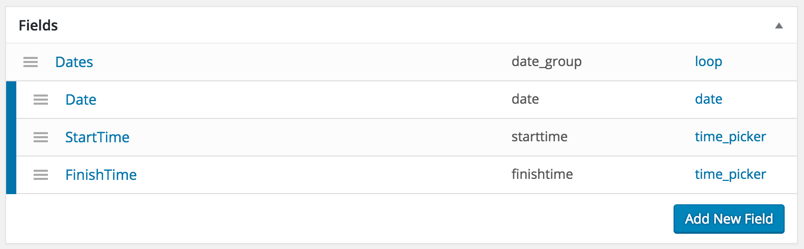

#  CFS Loop Field Query - For Events -

### Modify the Query to multiple dates in a post For [Custom Field Suite](https://wordpress.org/plugins/custom-field-suite/) "Loop Field".

#### Requirements
- - -
* PHP 5.3+
* Activation [Custom Field Suite](https://wordpress.org/plugins/custom-field-suite/) Plugin.
* Create a Loop Field and Date Field in the Loop Field using [CFS](https://wordpress.org/plugins/custom-field-suite/) Plugin.
* A 6-pack of beer🍺 (optional, I guess.)

#### Installation
- - -

 1. `cd /path-to-your/wp-content/plugins/`
 2. `git clone git@github.com:sectsect/cfs-loop-field-query.git`
 3. Activate the plugin through the 'Plugins' menu in WordPress.  
 You can access the some setting by going to `Settings` -> `CFS Loop Field Query`.
 4. Setting `Post Type Name`, `Loop Field Name`, `Date Field Name` in Loop Feld".  
 ( Optional Field: `Taxonomy Name`, `StartTime Field`, `FinishTime Field` )  
 That's it:ok_hand: The main query of your select post types will be modified.

#### Fields Structure Example
- - -
 

#### TIP
- - -
* If you want to apply to some existing article, resave the article.  
* This Plugin includes adding Time-Picker Field in CFS. (Using [CFS Time picker add-on](https://github.com/ersoma/cfs-time))
* Support Pages for `is_date()` includes `is_year()` `is_month()` `is_day()`.
* If you have set the 'FinishTime', it does not appear that post when it passes your set time. (Default: The Day Full)

### Usage Example
- - -
You can get a sub query using the `new CFS_LFQ_Query()`

#### Example: Sub Query
``` php
<?php
    $ary	 = array();
    $page    = (get_query_var('paged')) ? get_query_var('paged') : 1;
    $perpage = 10;
    $offset  = ($page - 1) * $perpage;
    $args    = array(
        'posts_per_page' => $perpage
    );
    $query = new CFS_LFQ_Query($args);
?>
<?php if ( $query->have_posts() ) : while ( $query->have_posts() ) : $query->the_post(); ?>
    // something
<?php endwhile; ?>
<?php endif;?>
<?php wp_reset_postdata(); ?>
```
#### Example: Sub Query For Calendar (Using `cfs_lfq_calendar()`)  
``` php
<?php
    $dates   = array();
    $args    = array(
        'posts_per_page' => -1,
        'calendar'       => true, // For get the data from not today but first day in this month.
    );
    $query = new CFS_LFQ_Query($args);
?>
<?php if ($query->have_posts()) : while ($query->have_posts()) : $query->the_post(); ?>
<?php
    $date = date('Ymd', strtotime($post->date));
    array_push($dates, $date);
?>
<?php endwhile; endif; ?>
<?php wp_reset_postdata(); ?>

<?php
    // Passing array to cfs_lfq Calendar Class.
    $dates  = array_unique($dates);	// Remove some Duplicate Values(Day)
    $date   = new DateTime();
    $months = array();
    for ($i = 0; $i < 3; ++$i) {	  // 3 months Calendar
        if ($i > 0) {
            $date->modify('first day of +1 month');
        } else {
            $date->modify('first day of this month');
        }
        array_push($months, $date->format('Ym'));
    }
	$args = array(
		'dates'        => $dates,		// (array) (required) Array of event Date ('Ymd' format)
		'months'       => $months,		// (array) (required) Array of month to generate calendar ('Ym' format)
		'weekdayLabel' => 'default',	// (string) (optional) Available value: 'default' or 'en' Note: 'default' is based on your wordpress locale setting.
		'weekdayBase'  => 0,			// (integer) (optional) The start weekday. 0:sunday ～ 6:saturday Default: 0
		'element'      => 'div',		// (string) (optional) The element for wraping. Default: 'div'
		'class'        => ''			// (string) (optional) The 'class' attribute value for wrap element. Default: ''
	);
	cfs_lfq_calendar($args);
?>
```
#### Example: Sub Query For Calendar (Using Your Calendar Class)
``` php
<?php
    $ary	 = array();
    $args    = array(
        'posts_per_page'    => -1,
        'calendar'          => true		// For get the data from not today but first day in this month.
    );
    $query = new CFS_LFQ_Query($args);
?>
<?php if ( $query->have_posts() ) : while ( $query->have_posts() ) : $query->the_post(); ?>
<?php
    $date       = date('Ymd', strtotime($post->date));
    $post_id    = $post->ID;
    $perm       = get_the_permalink();
    $title      = get_the_title();
    array_push($ary, array('date' => $date, 'id' => $post_id, 'permlink' => $perm, 'title' => $title));
?>
<?php endwhile; endif; ?>
<?php wp_reset_postdata(); ?>

<?php
    // Passing array to your Calendar Class.
    require_once 'Calendar/Month/Weeks.php';
    calendar($ary, 0);
?>
```
#### Example: Get the "Date", "StartTime" and "FinishTime"
``` php
<div id="date">
    <?php echo date('Y-m-d', strtotime($post->date)); ?>
</div>
<time>
    <?php echo date("H:i", strtotime($post->starttime)); ?> ~ <?php echo date("H:i", strtotime($post->finishtime)); ?>
</time>
```

### function
- - -
#### cfs_lfq_calendar($args)  
##### Parameters

* **dates**
(array) (required) Array of event Date ('Ymd' format).

* **months**
(array) (required) Array of month to generate calendar ('Ym' format)

* **weekdayLabel**
(string) (optional) Available value: `'default'` or `'en'`.  
Default: `'default'`  
:memo: `'default'` is based on your wordpress locale setting.

* **weekdayBase**
(integer) (optional) The start weekday. 0:sunday ～ 6:saturday  
Default: `0`

* **element**
(string) (optional) The element for wraping.  
Default: `'div'`

* **class**
(string) (optional) The 'class' attribute value for wrap element.  
Default: `''`

##### Example

```php
<?php
$args = array(
	'dates'        => $dates,
	'months'       => $months,
	'weekdayLabel' => 'default',
	'weekdayBase'  => 0,
	'element'      => 'div',
	'class'        => 'myclass'
);
cfs_lfq_calendar($args);
?>
```

### NOTES for Developer
- - -
* This Plugin does not hosting on the [wordpress.org](https://wordpress.org/) repo in order to prevent a flood of support requests from wide audience.

### Change log  
- - -
 * **2.0.5** - Refactor composer dirctory & Update composer package.
 * **2.0.4** - Add composer.json.
 * **2.0.3** - Add options to function `cfs_lfq_calendar()`.
 * **2.0.2** - Modify a html tag & Add class to html container element for `cfs_lfq_calendar()` generate calendar.
 * **2.0.0** - Add Date & Time column on Edit page.
 * **1.2.6** - Add [Select2](https://github.com/select2/select2) for `<select>` boxes on Settings page.
 * **1.2.5** - Update [CalendR](https://github.com/yohang/CalendR) PHP Class to 1.1.
 * **1.2.4** - Add "today" class to current day for calendar.
 * **1.2.3** - Add weekday class to table header for calendar.
 * **1.2.2** - Add Automatically sort the loop field for the date in ascending order before you save the data.
 * **1.2.1** - Change Some field type on Admin-Page from the `<input type="text">` to `<select>`.
 * **1.2.0** - Add function for Calendar `cfs_lfq_calendar()`. Using [CalendR](https://github.com/yohang/CalendR) PHP Class.
 * **1.1.1** - Change If you have set the 'FinishTime', it does not appear that post when it passes your set time. (Default: the day full)
 * **1.1.0** - Support Add support "StartTime" and "FinishTime" for each Date in Loop Field.
 * **1.0.0** - Initial Release

### License
See [LICENSE](https://github.com/sectsect/cfs-loop-field-query/blob/master/LICENSE) file.
